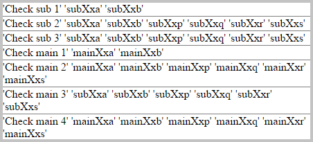

Systematic code examples: a guided tour of Transcrypt
=====================================================

One ready-to-run code example is worth more than ten lengthy descriptions. The *autotest and demo suite*, that is part of the distribution, is a collection of sourcecode fragments called *testlets*. These testlets are used for automated regression testing of Transcrypt against CPython.
Since they systematically cover all language constructs, they are also very effective as a learning tool. The testlets are arranged alphabetically by subject.

.. literalinclude:: ../../development/automated_tests/transcrypt/autotest.py
	:tab-width: 4
	:caption: Autotest: Transcrypt autotest demo suite

.. _autotest_arguments:

Arguments: \*\*kwargs, \*args, defaults, at call and def time, also for lambda's
--------------------------------------------------------------------------------

.. literalinclude:: ../../development/automated_tests/transcrypt/arguments/__init__.py
	:tab-width: 4
	:caption: Testlet: arguments

Attribute access by name: getattr, setattr, hasattr
---------------------------------------------------

.. literalinclude:: ../../development/automated_tests/transcrypt/attribs_by_name/__init__.py
	:tab-width: 4
	:caption: Testlet: attribs_by_name

Attribute proxies by name: __getattr__, __setattr__
---------------------------------------------------

.. literalinclude:: ../../development/automated_tests/transcrypt/proxies/__init__.py
	:tab-width: 4
	:caption: Testlet: proxies

Bytes and bytearrays: initial support
-------------------------------------

.. literalinclude:: ../../development/automated_tests/transcrypt/byte_arrays/__init__.py
	:tab-width: 4
	:caption: Testlet: byte_arrays

Callable or not: using the callable () built-in function
--------------------------------------------------------

The *callable (object)* built-in function will tell you if something supports the () operator.

.. literalinclude:: ../../development/automated_tests/transcrypt/callable_test/__init__.py
	:tab-width: 4
	:caption: Testlet: callable_test
    
Classes: multiple inheritance and assignment of bound functions
---------------------------------------------------------------

.. literalinclude:: ../../development/automated_tests/transcrypt/classes/__init__.py
	:tab-width: 4
	:caption: Testlet: classes

Complex numbers: Python's builtin complex datatype
--------------------------------------------------

.. literalinclude:: ../../development/automated_tests/transcrypt/complex_numbers/__init__.py
	:tab-width: 4
	:caption: Testlet: complex_numbers

Conditional expressions: simple and nested
------------------------------------------

.. literalinclude:: ../../development/automated_tests/transcrypt/conditional_expressions/__init__.py
	:tab-width: 4
	:caption: Testlet: conditional_expressions

Control structures: for...else, while...else, if...elif...else, break, continue
-------------------------------------------------------------------------------

.. literalinclude:: ../../development/automated_tests/transcrypt/control_structures/__init__.py
	:tab-width: 4
	:caption: Testlet: control_structures

Data classes: Avoiding boilerplate code
---------------------------------------

.. literalinclude:: ../../development/automated_tests/transcrypt/data_classes/__init__.py
	:tab-width: 4
	:caption: Testlet: data_classes

Data structures: tuple, list, dict, set
---------------------------------------

.. literalinclude:: ../../development/automated_tests/transcrypt/data_structures/__init__.py
	:tab-width: 4
	:caption: Testlet: data_structures

Decorators: function and class, with and without parameters
-----------------------------------------------------------

Transcrypt supports decorators on methods and classes. A decorator itself can be a function or an object with an overloaded __call__ operator. Parameterized decorator factories are also supported. All flavours of properties can be used directly or through decorator syntax. Extensive use of properties is demonstrated in the :ref:`properties testlet <autotest_properties>`.

.. literalinclude:: ../../development/automated_tests/transcrypt/decorators/__init__.py
	:tab-width: 4
	:caption: Testlet: decorators

Dict comprehensions
-------------------

.. literalinclude:: ../../development/automated_tests/transcrypt/dict_comprehensions/__init__.py
	:tab-width: 4
	:caption: Testlet: dict_comprehensions
	
Dictionaries: dict revisited
----------------------------

.. literalinclude:: ../../development/automated_tests/transcrypt/dictionaries/__init__.py
	:tab-width: 4
	:caption: Testlet: dictionaries

.. _autotest_docstrings:
	
Diverse issues
--------------

.. literalinclude:: ../../development/automated_tests/transcrypt/div_issues/__init__.py
	:tab-width: 4
	:caption: Testlet: div_issues
	
Diverse pulls
-------------

.. literalinclude:: ../../development/automated_tests/transcrypt/div_pulls/__init__.py
	:tab-width: 4
	:caption: Testlet: div_pulls
	
Docstrings: __doc__ attribute generated optionally
--------------------------------------------------

To keep the generated code lean, generation of *__doc__* attributes is controlled per module by *__pragma__ ('docat')* or by the *-d* / *--docat* command line switch, combined with user per module of *__pragma__ ('nodocat')*

.. literalinclude:: ../../development/automated_tests/transcrypt/docstrings/__init__.py
	:tab-width: 4
	:caption: Testlet: docstrings

Exceptions: exception class hierarchy, finally
----------------------------------------------

.. literalinclude:: ../../development/automated_tests/transcrypt/exceptions/__init__.py
	:tab-width: 4
	:caption: Testlet: exceptions

Extended slices: facilitating NumScrypt and such
------------------------------------------------

.. literalinclude:: ../../development/automated_tests/transcrypt/extended_slices/__init__.py
	:tab-width: 4
	:caption: Testlet: extended_slices

General functions: sort and sorted
----------------------------------

.. literalinclude:: ../../development/automated_tests/transcrypt/general_functions/__init__.py
	:tab-width: 4
	:caption: Testlet: general_functions

Global variable access by using globals () [<variable_name>]
------------------------------------------------------------

The *globals ()* function does the same as its counterpart in CPython, with some restrictions.

In the same module:

- *globals ()* can retrieve all module-level variables, whether created via *globals ()* or in the normal way
- module-level variables created via *globals ()* can only be retrieved by *globals ()*, not as a normal variable

From a different module:

- *globals ()* can retrieve all module-level variables, whether created by *globals ()* or in the normal way
- module-level variables created by *globals ()* can be retrieved by *globals ()*, but also as a normal variable

Since imports are done (statically) at compile time, *from ... import \** will not include the variables created (dynamically) via *globals ()*.
You can however import the whole module, e.g. *import <longName> as <shortName>* and then use *<shortName>.<dynamicallyCreatedVariable>*.

The code below shows what's possible:

.. literalinclude:: ../../development/automated_tests/transcrypt/globals_function/sub.py
	:tab-width: 4
	:caption: Testlet: globals_function, module sub

.. literalinclude:: ../../development/automated_tests/transcrypt/globals_function/__init__.py
	:tab-width: 4
	:caption: Testlet: globals_function, main program
    
The output will be:

Indices and slices: LHS, RHS, basic and extended
------------------------------------------------

.. literalinclude:: ../../development/automated_tests/transcrypt/indices_and_slices/__init__.py
	:tab-width: 4
	:caption: Testlet: indices_and_slices

Iterators and generators
------------------------

.. literalinclude:: ../../development/automated_tests/transcrypt/iterators_and_generators/__init__.py
	:tab-width: 4
	:caption: Testlet: iterators_and_generators

Lambda functions with all types of args
---------------------------------------

.. literalinclude:: ../../development/automated_tests/transcrypt/lambda_functions/__init__.py
	:tab-width: 4
	:caption: Testlet: lambda_functions

List comprehensions: multi-loop and nested with multiple if's
-------------------------------------------------------------

.. literalinclude:: ../../development/automated_tests/transcrypt/list_comprehensions/__init__.py
	:tab-width: 4
	:caption: Testlet: list_comprehensions

Local classes: inside other classes and functions
-------------------------------------------------

.. literalinclude:: ../../development/automated_tests/transcrypt/local_classes/__init__.py
	:tab-width: 4
	:caption: Testlet: local_classes

Metaclasses: overriding type.__new__ in a descendant metaclass
--------------------------------------------------------------

.. literalinclude:: ../../development/automated_tests/transcrypt/metaclasses/__init__.py
	:tab-width: 4
	:caption: Testlet: metaclasses

Method and class decorators
---------------------------

.. literalinclude:: ../../development/automated_tests/transcrypt/method_and_class_decorators/__init__.py
	:tab-width: 4
	:caption: Testlet: method_and_class_decorators

Module builtin: a small part of it demo'ed
------------------------------------------

.. literalinclude:: ../../development/automated_tests/transcrypt/module_builtin/__init__.py
	:tab-width: 4
	:caption: Testlet: module_builtin

Module cmath: almost all of Python's cmath module
-------------------------------------------------

.. literalinclude:: ../../development/automated_tests/transcrypt/module_cmath/__init__.py
	:tab-width: 4
	:caption: Testlet: module_cmath

Module datetime: transcryption of Python's datetime module
----------------------------------------------------------

.. literalinclude:: ../../development/automated_tests/transcrypt/module_datetime/__init__.py
	:tab-width: 4
	:caption: Testlet: module_datetime

Module itertools: almost all of Python's itertools module
---------------------------------------------------------

.. literalinclude:: ../../development/automated_tests/transcrypt/module_itertools/__init__.py
	:tab-width: 4
	:caption: Testlet: module_itertools

Module math: almost all of Python's math module
-----------------------------------------------

.. literalinclude:: ../../development/automated_tests/transcrypt/module_math/__init__.py
	:tab-width: 4
	:caption: Testlet: module_math

Module random: most important functions of Python's random module
-----------------------------------------------------------------

.. literalinclude:: ../../development/manual_tests/module_random/module_random.py
	:tab-width: 4
	:caption: Manual_test: module_random

Module re: transcryption of Python's re module
----------------------------------------------

.. literalinclude:: ../../development/automated_tests/re/autotest.py
	:tab-width: 4
	:caption: Testlet: re/autotest

.. literalinclude:: ../../development/automated_tests/re/basictests.py
	:tab-width: 4
	:caption: Testlet: re/basictests

.. literalinclude:: ../../development/automated_tests/re/basic_pyre.py
	:tab-width: 4
	:caption: Testlet: re/basic_pyre

.. literalinclude:: ../../development/automated_tests/re/basic_jsre.py
	:tab-width: 4
	:caption: Testlet: re/basictests

Module time: transcryption of Python's time module
--------------------------------------------------

.. literalinclude:: ../../development/automated_tests/time/autotest.py
	:tab-width: 4
	:caption: Testlet: time/testlet0

.. literalinclude:: ../../development/automated_tests/time/testlet0.py
	:tab-width: 4
	:caption: Testlet: time/testlet0

.. literalinclude:: ../../development/automated_tests/time/mult_time.py
	:tab-width: 4
	:caption: Testlet: time/mult_time

.. literalinclude:: ../../development/automated_tests/time/strptime.py
	:tab-width: 4
	:caption: Testlet: time/strptime

Modules: hierarchical, both local to the project and global url-based
---------------------------------------------------------------------

.. literalinclude:: ../../development/automated_tests/transcrypt/modules/__init__.py
	:tab-width: 4
	:caption: Testlet: modules

Nonlocals
---------

.. literalinclude:: ../../development/automated_tests/transcrypt/nonlocals/__init__.py
	:tab-width: 4
	:caption: Testlet: nonlocals

Operator overloading
--------------------

.. literalinclude:: ../../development/automated_tests/transcrypt/operator_overloading/__init__.py
	:tab-width: 4
	:caption: Testlet: operator_overloading
	
.. _autotest_properties:
	
Properties
----------

.. literalinclude:: ../../development/automated_tests/transcrypt/properties/__init__.py
	:tab-width: 4
	:caption: Testlet: properties
		
Representation as text: the repr and str built-in functions
-----------------------------------------------------------

.. literalinclude:: ../../development/automated_tests/transcrypt/reprtest/__init__.py
	:tab-width: 4
	:caption: Testlet: reprtest
		
Set comprehensions
------------------

.. literalinclude:: ../../development/automated_tests/transcrypt/set_comprehensions/__init__.py
	:tab-width: 4
	:caption: Testlet: set_comprehensions

Super
-----

The *super ()*  builtin function is supported for cases where there's exactly one path upwards to exactly one matching method.
This covers most use cases, even in a diamond class hierarchy, and results in fast and compact code.
In case of more than one path, possibly to more than one matching method, use explicit class names, as shown in the example below.

.. literalinclude:: ../../development/automated_tests/transcrypt/builtin_super/__init__.py
	:tab-width: 4
	:caption: Testlet: builtin_super
		
Simple and augmented assignment
-------------------------------

.. literalinclude:: ../../development/automated_tests/transcrypt/simple_and_augmented_assignment/__init__.py
	:tab-width: 4
	:caption: Testlet: simple_and_augmented_assignment
		
Truthyness: optional Python-style evaluation of truthyness, falsyness and non-empty container selection
-------------------------------------------------------------------------------------------------------

.. literalinclude:: ../../development/automated_tests/transcrypt/truthyness/__init__.py
	:tab-width: 4
	:caption: Testlet: truthyness
	
Tuple assignment: recursive and in for-headers using enumerate
--------------------------------------------------------------

.. literalinclude:: ../../development/automated_tests/transcrypt/tuple_assignment/__init__.py
	:tab-width: 4
	:caption: Testlet: tuple_assignment
	